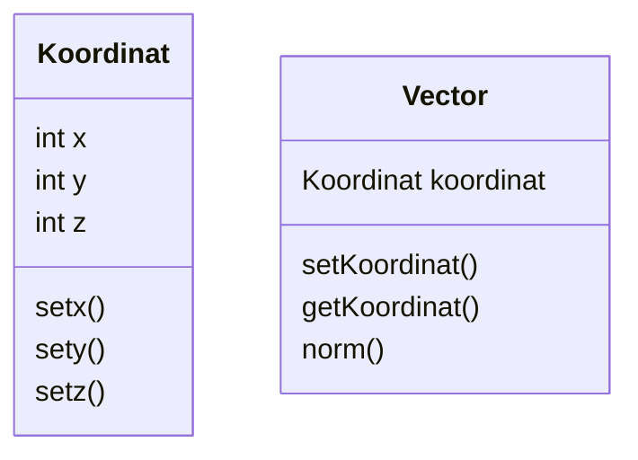

# Tugas Struktur Data

## Introduction Section
1. Jelaskan definisi object dalam Paradigma Object-Oriented!
2. Jelaskan tiga tujuan dalam Paradigma Object-Oriented!
3. Jelaskan tiga prinsip dalam Paradigma Object-Oriented!
4. Sebutkan contoh design pattern dalam Paradigma Object-Oriented!

##Jawaban
1. Paradigma Object-Oriented mengkombinasikan data dan fungsi untuk mengakses data menjadi sebuah kesatuan unit yang dikenal dengan nama objek. Objek adalah struktur data yang terdiri dari bidang data dan metode bersama dengan interaksi mereka untuk merancang aplikasi dan program komputer. Pada paradigma Object Oriented, object-object tersebut dapat berkerja sendiri dan juga dapat saling bekerja sama dengan kemungkinkan untuk saling berhubungan, seperti menerima, mengirim data kepada object lainnya dan memproses data.

2. 1). Object Oriented Programming memodelkan hal-hal kompleks sebagai struktur sederhana yang dapat direproduksi. Kode OOP dapat digunakan kembali
   
   2). Object Oriented Programming mencegah duplikasi kode. Object Oriented Programming melindungi informasi melalui enkapsulasi. Data Object hanya dapat 	 diakses melalui properti dan metode publik
  
  3). OOP mempermudah perbaikan bug. Memperbaiki kesalahan yang terdapat dalam kelas yang terstruktur dengan baik lebih mudah daripada menemukan kesalahan 	   di banyak tempat dalam kode.

3. 1). Pewarisan: kelas anak mewarisi data dan perilaku dari kelas induk.Pewarisan memungkinkan kelas mewarisi fitur kelas lain, pewarisan juga dikenal 	sebagai prototyping. 
  
   2). Enkapsulasi: berisi informasi dalam suatu objek, hanya menampilkan informasi yang dipilih.Atribut dan perilaku ditentukan oleh kode di dalam template 	    kelas. 
   
   3). Polimorfisme: banyak metode dapat melakukan tugas yang sama. Polimorfisme memungkinkan metode yang sama untuk mengeksekusi perilaku yang berbeda dalam 	     dua cara: penggantian metode dan overloading metode.
   
4.  Design pattern merupakan komponen yang diperlukan dalam proses reusable-code pada pemrograman berorientasi objek.

## Class and Object
1. Jelaskan definisi Class!
2. Jelaskan perbedaan Attribute dengan Method!
3. Jelaskan apa itu instansiasi Object!
4. Jelaskan apa itu identifier!

### Jawaban
1. Class adalah cetak biru atau blueprint dari object. Class digunakan hanya untuk membuat kerangka dasar. 
2. Atribut adalah ciri-ciri yang melekat pada suatu object. Sedangkan method adalah fungsi-fungsi yang dapat digunakan untuk memanipulasi nilai-nilai pada atribut atau untuk melakukan hal-hal yang dapat dilakukan suatu object.
3. instansiasi Object merupakan suatu proses dalam pembentukan object dari class yang ada.
4. Identifier adalah sebuah pengenal atau pengidentifikasi yang kita deklarasikan agar kompiler dapat mengenalinya. atau Identifier juga biasa diartikan sebagai nama yang diberikan untuk penamaan objek, Identifier dapat berupa nama variabel, nama konstanta, nama fungsi, nama prosedur maupun nama namescape. 

## Implementing Class
Implementasikan kelas diagram "Kendaraan" berikut ke dalam Python!

   Class Kendaraan :
   
    - string nomorPlat
    - string merk
    - string jenis
    - string warna
    - int tanggalBeli
    - int bulanBeli
    - int tahunBeli
    - double berat
    - double harga
    - showTanggalPembelian()
   


## Main OOP Concept
1. Jelaskan konsep encapsulation dalam Paradigma Object-Oriented!
2. Jelaskan konsep inheritance dalam Paradigma Object-Oriented!
3. Jelaskan perbedaan public method dan private method dalam encapsulation!
4. Jelaskan perbedaan superclass dan subclass dalam inheritance!

##Jawaban

1.Enkapsulasi adalah fungsi fungsi yang dihimpun dalam sebuah class
2.Inheritance adalah sifat sifat yang diturunkan class terhadap fungsi-fungsi yang berada di dalamnya sehingga setiap fungsi memiliki sifat yang mirip dengan fungsi yang lainnya
3.Publik adalah variabel yang dapat diakses oleh seluruh fungsi sementara privat adalah fungsi yang hanya bisa diakses oleh fungsi yang mendeklarasikannya
4.Superclass adalah kelas yang menghimpun subclass sementara subclass adalah class yang berada di dalam superclass

## Programming Exercise
- Buatlah class diagram dari code python berikut ini:

```python
class Koordinat:
	def __init__(self,x,y):
		self.z = 0
		self.x = x
		self.y = y
	def set_x(self,x):
		self.x = x
	def increment_x(self):
		self.x+=1
	def __str__(self):
		return f"x : {self.x} , y:{self.y} , z:{self.z}"
```

- Implementasikan class diagram berikut menjadi program python!



- fungsi norm() adalah fungsi untuk menghitung norm dari sebuah vector yaitu
norm = $\sqrt{x^2 + y^2 + z^2}$ . Buatlah fungsi untuk menghitung norm dari vector berdasarkan class yang telah anda buat! 

- Euclidian Distance adalah jarak antara 2 vector dan didefinisikan sebagai 
$$d = \sqrt{ (x_1 - x_2)^2 + (y_1 - y_2)^2 + (x_1 - x_2)^2 } $$
buatlah program untuk menghitung euclidian distance antara 2 vector berdasarkan class yang telah anda buat!

- Perhatikan tabel berikut

| Vector | x   | y   | z   | kelas |
| ------ | --- | --- | --- | ----- |
| A      | 0   | 1   | 1   | 0     |
| B      | 2   | 2   | 2   | 1     |
| C      | 1.5 | 1.2 | 1.5 | 1     |
| D      | 10  | 9   | 8   | 0     |
| E      | 5   | 5   | 5   | 0     |
| F      | 8   | 8   | 8   | 0     |
| G      | 6   | 6   | 1   | 0     |
| H      | 3   | 3   | 3   | ?     |

Salah satu metode dalam data science untuk melakukan klasifikasi adalah dengan menggunakan k-nearest neighbor, dimana cara menentukan label kelas adalah dengan cara melihat tetangga dengan euclidian distance terdekat. Tentukan kelas dari vector H dengan cara:
- Tentukan 3 tetangga paling dekat dari H 
- dari 3 tetangga tersebut, pilih kelas yang paling banyak muncul
- Jadikan kelas yang paling banyak muncul tersebut sebagai kelas dari vector H

Implementasikan algoritma tersebut menggunakan program python dengan paradigma object-oriented programming yang telah anda pelajari!

```python
from math import sqrt
import statistics
class Vektor:
  def __init__(self, vektor, x, y, z, Namavektor):
    self.vektor = vektor
    self.x = x
    self.y = y
    self.z = z
    self.Namavektor = Namavektor
    self.KelasH = 0
  def Panjang(self):
    vktr = []
    Panjang = []
    # Panjang ttngg
    for i in self.vektor:
        komponen_vektor = list(self.vektor[i].values())
        def dekat(komponen_vektor):
            DistanceJarak = 0
            for i in komponen_vektor:
                DistanceJarak = sqrt((self.x-komponen_vektor[1])**2 + (self.y-komponen_vektor[2])**2 + (self.z-komponen_vektor[3])**2)
            return DistanceJarak
        vktr = vktr + [self.vektor[i]]
        Panjang = Panjang + [round(dekat(komponen_vektor), 2)]
        print(f"Panjang vektor {self.vektor[i]['vektor']} dengan vektor H adalah sebesar {round(dekat(komponen_vektor), 2)}")
    Nilai_Sortir = sorted(Panjang)
    ttngg = {}
    for i in range(len(Panjang)):
        ttngg[Panjang[i]] = vktr[i]    
    print("Urutannya adalah:")
    for j in range(len(Nilai_Sortir)): 
        print(f"Panjang vektor {ttngg[Nilai_Sortir[j]]['vektor']} dengan vektor H adalah sebesar {Nilai_Sortir[j]}")
    print("3 Tetangga terdekat:")
    kelas = []
    for k in range(3):
        print(f"Vektor {ttngg[Nilai_Sortir[k]]['vektor']} dengan kelas {ttngg[Nilai_Sortir[k]]['kelas']} pada Panjang {Nilai_Sortir[k]} dengan vektor H")
        kelas = kelas + [ttngg[Nilai_Sortir[k]]['kelas']]
    self.KelasH = statistics.mode(kelas)
    print("Kelas yang paling banyak muncul adalah = ", self.KelasH)
    print("Kelas dari vektor H = ", self.KelasH)
  def hasil(self):
    return {'vektor': self.Namavektor, 'x' : self.x, 'y' : self.y, 'z': self.z, 'kelas': self.KelasH}
 ```
 
 
 ```python
 def hasil(self):
    return {'vektor': self.Namavektor, 'x' : self.x, 'y' : self.y, 'z': self.z, 'kelas': self.KelasH}
TableOfVevtor = {
    "vektor1" : {'vektor': 'A', 'x' : 0, 'y' : 1, 'z': 1, 'kelas': 0 },
    "vektor2" : {'vektor': 'B', 'x' : 2, 'y' : 2, 'z': 2, 'kelas': 1},
    "vektor3" : {'vektor': 'C', 'x' : 1.5, 'y' : 1.2, 'z': 1, 'kelas': 1},
    "vektor4" : {'vektor': 'D', 'x' : 10, 'y' : 9, 'z': 0, 'kelas': 0},
    "vektor5" : {'vektor': 'E', 'x' : 5, 'y' : 5, 'z': 5, 'kelas': 0},
    "vektor6" : {'vektor': 'F', 'x' : 8, 'y' : 8, 'z': 0, 'kelas': 0},
    "vektor7" : {'vektor': 'G', 'x' : 6, 'y' : 6, 'z': 0, 'kelas': 0},
}
for KeyOfVector in TableOfVevtor:
    print(TableOfVevtor[KeyOfVector])
print("\n")
data = Vektor(TableOfVevtor, 3, 3, 3, "H")
data.Panjang()
print(data.hasil())
TableOfVevtor["vektor8"] = data.hasil()
print("\n")
for KeyOfVector in TableOfVevtor:
    print(TableOfVevtor[KeyOfVector])
```


